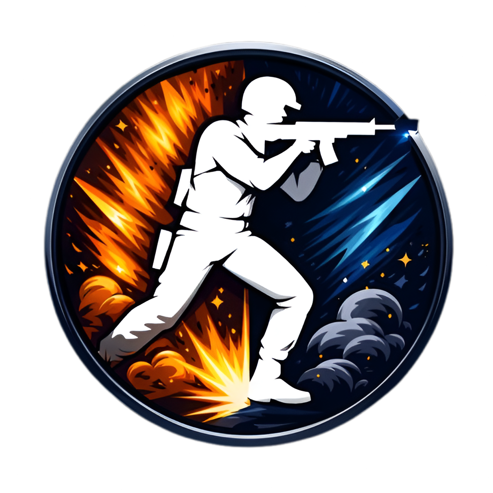
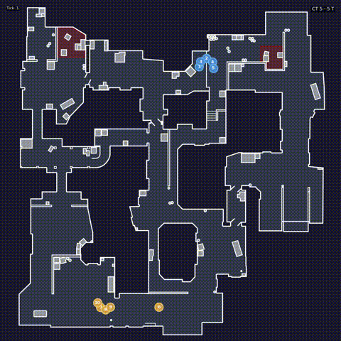

<div align="center">



# FragAudit

**CS2 Demo Analysis Engine with Tactical Intelligence**

[](LICENSE)
[](https://www.python.org/downloads/)
[](tests/)
[](https://github.com/Pl4yer-ONE/FragAudit/actions)

</div>

---

## 🎬 Radar Replay Demo

<div align="center">



*Boltobserv-style radar with numbered players (1-10), view cones, smokes, and kills*

**[📥 Download Full Video](docs/radar_demo.mp4)** (4.4 MB)

</div>

Radar images powered by [boltobserv](https://github.com/boltgolt/boltobserv) (GPL-3).

---

## 🔬 What is FragAudit?

FragAudit parses CS2 `.dem` files and provides deep tactical analysis:

| Feature | Description |
|---------|-------------|
| **Mistake Detection** | Flags positioning errors (overpeek, no trade, spacing) |
| **Role Intelligence** | Auto-detects player roles per round (Entry, Lurk, Anchor) |
| **Win Prediction** | Forecasts round outcomes with explainable factors |
| **Strategy Clustering** | Identifies team patterns (Execute, Rush, Default) |
| **Radar Replay** | Boltobserv-style MP4 video of round playback |

This is a **backend engine** — no black boxes, all coefficients explicit.

---

## 📦 Backend Pillars (v3.8)

| Module | Version | What It Does |
|--------|---------|--------------|
| **Mistakes** | v3.4 | Detects OVERPEEK, NO_TRADE_SPACING, 5 error types |
| **Roles** | v3.5 | Classifies ENTRY, LURK, ANCHOR, ROTATOR, SUPPORT |
| **WPA** | v3.6 | Contextual win probability (economy, clutch, time) |
| **Strategy** | v3.7 | Clusters EXECUTE, RUSH, SPLIT, DEFAULT patterns |
| **Prediction** | v3.8 | Hand-written logistic regression for P(round_win) |

**174 unit tests. No ML libraries. Fully explainable.**

---

## 🚀 Quick Start

### Step 1: Install

```bash
git clone https://github.com/Pl4yer-ONE/FragAudit.git
cd FragAudit
python -m venv venv
source venv/bin/activate  # Windows: venv\Scripts\activate
pip install -r requirements.txt
```

### Step 2: Verify

```bash
python -m pytest tests/ -q
# 174 passed
```

### Step 3: Analyze a Demo

```bash
python main.py analyze --demo match.dem --html --radar
```

**Outputs:**
- `reports/coaching_report_*.json` — Raw data
- `reports/report_*.html` — Visual HTML report  
- `reports/radar_*.mp4` — Radar replay video

---

## 📊 Sample Output

### HTML Report

<div align="center">


*Issue distribution, round breakdown, and match summary*

</div>

### Player Cards

<div align="center">


*Individual stats with Trade Score and mistake details*

</div>

---

## 💻 Usage Examples

### Basic Analysis
```bash
python main.py analyze --demo match.dem
```

### With HTML Report
```bash
python main.py analyze --demo match.dem --html
```

### With Radar Video
```bash
python main.py analyze --demo match.dem --radar
```

### Full Pipeline (HTML + Radar + Timeline)
```bash
python main.py analyze --demo match.dem --html --radar --timeline
```

### One-Click Script
```bash
./run_analysis.sh match/your-demo.dem
```

---

## 🧠 Prediction API

```python
from src.predict import predict_round_win

result = predict_round_win(
    team_economy=1500,   # eco round
    enemy_economy=4500,  # gun round
    team_alive=5,
    enemy_alive=4,       # man advantage
    mistake_count=1,
    strategy="EXECUTE_A"
)

print(f"Win probability: {result.probability:.0%}")  # 43%
print(f"Dominant factor: {result.dominant_factor}")  # economy
print(f"Factors: {result.factors}")
# {'economy': -0.45, 'man_advantage': 0.2, 'mistakes': -0.08}
```

Every prediction shows **why** — factor breakdown included.

---

## 📁 Project Structure

```
FragAudit/
├── src/
│   ├── mistakes/        # Error detection (v3.4)
│   ├── roles/           # Role classification (v3.5)
│   ├── wpa/             # Win probability (v3.6)
│   ├── strategy/        # Strategy clustering (v3.7)
│   ├── predict/         # Win prediction (v3.8)
│   ├── radar/           # Boltobserv radar replay
│   ├── timeline/        # Round event streams
│   └── report/          # JSON/HTML output
├── tests/               # 174 unit tests
├── docs/                # Documentation + screenshots
├── match/               # Demo files (.dem)
└── reports/             # Generated output
```

---

## 🗺️ Roadmap

### Completed ✓
- [x] v3.0 — Mistake detection, JSON/Markdown reports
- [x] v3.4 — **Mistake Detection Engine**
- [x] v3.5 — **Role Intelligence Engine**
- [x] v3.6 — **Contextual WPA**
- [x] v3.7 — **Strategy Clustering**
- [x] v3.8 — **Prediction Model**

### Backend Complete ✓

---

## ⚠️ Known Limitations

1. Strategy detection uses first contact timing only (no utility patterns)
2. No cross-round memory (each round is independent)
3. Radar covers first ~20 minutes by default

See [TECHNICAL.md](docs/TECHNICAL.md) for details.

---

## 📜 License

**GNU General Public License v3.0**

- Free to use, modify, and distribute
- Modifications must be open-sourced under GPLv3
- Radar images from [boltobserv](https://github.com/boltgolt/boltobserv) (GPL-3)

See [LICENSE](LICENSE) and [THIRDPARTY.md](THIRDPARTY.md).

---

## 🤝 Contributing

Contributions welcome under GPLv3.

```bash
python -m pytest tests/ -v  # Run tests first
```

See [CONTRIBUTING.md](CONTRIBUTING.md) for guidelines.

---

<div align="center">

**FragAudit** — Turn demos into tactical intelligence.

*174 tests. 5 backend pillars. No black boxes.*

[](https://github.com/Pl4yer-ONE/FragAudit)

</div>
