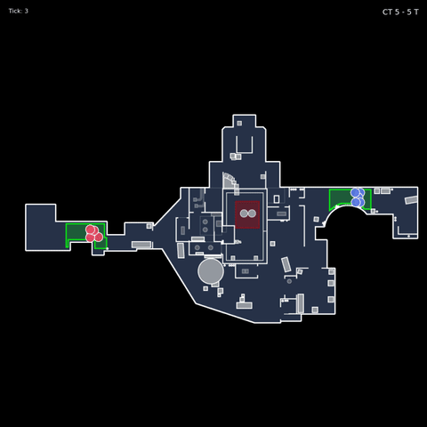

<div align="center">


# FragAudit

**CS2 Demo Analysis Engine with Tactical Intelligence**

[](LICENSE)
[](https://www.python.org/downloads/)
[](tests/)
[](https://github.com/Pl4yer-ONE/FragAudit/actions)

</div>

---

## What Is This?

FragAudit parses CS2 `.dem` files and provides deep tactical analysis:

- **Mistake Detection** — Flags positioning errors (overpeek, no trade, spacing)
- **Role Intelligence** — Auto-detects player roles per round (Entry, Lurk, Anchor)
- **Win Prediction** — Forecasts round outcomes from context
- **Strategy Clustering** — Identifies team patterns (Execute, Rush, Default)

This is a **backend engine**, not a stats dashboard. It's built for coaches, analysts, and developers who want real tactical insights.

---

## Backend Pillars

| Module | Version | What It Does |
|--------|---------|--------------|
| **Mistakes** | v3.4 | Detects OVERPEEK, NO_TRADE_SPACING, 5 error types |
| **Roles** | v3.5 | Classifies ENTRY, LURK, ANCHOR, ROTATOR, SUPPORT per round |
| **WPA** | v3.6 | Contextual win probability (economy, clutch, time multipliers) |
| **Strategy** | v3.7 | Clusters EXECUTE, RUSH, SPLIT, DEFAULT patterns |
| **Prediction** | v3.8 | Hand-written logistic regression for P(round_win), P(impact) |

All 5 pillars have explicit coefficients, bounded outputs, and explainable results.  
**174 unit tests. No ML libraries. No black boxes.**

---

## Quick Example

```python
from src.predict import predict_round_win

result = predict_round_win(
    team_economy=1500,   # eco round
    enemy_economy=4500,  # gun round
    team_alive=5,
    enemy_alive=4,       # man advantage
    mistake_count=1,
    strategy="EXECUTE_A"
)

print(f"Win probability: {result.probability:.0%}")  # 43%
print(f"Dominant factor: {result.dominant_factor}")  # economy
print(f"Factors: {result.factors}")
# {'economy': -0.45, 'man_advantage': 0.2, 'mistakes': -0.08, 'strategy': 0.05}
```

Every prediction shows **why** — factor breakdown included.

---

## Installation

```bash
git clone https://github.com/Pl4yer-ONE/FragAudit.git
cd FragAudit
python -m venv venv
source venv/bin/activate  # Windows: venv\Scripts\activate
pip install -r requirements.txt
```

Verify:
```bash
python -m pytest tests/ -q
# 174 passed
```

---

## Usage

### Analyze a Demo
```bash
python main.py analyze --demo match.dem --html
```

### Generate Reports
```bash
python main.py analyze --demo match.dem --markdown  # Markdown
python main.py analyze --demo match.dem --csv       # CSV export
python main.py analyze --demo match.dem --timeline  # Event stream
```

### AI Coaching (Optional)
```bash
python main.py analyze --demo match.dem --ollama
```

---

## Project Structure

```
src/
├── mistakes/        # Error detection engine (v3.4)
├── roles/           # Role classification (v3.5)
├── wpa/             # Contextual WPA calculator (v3.6)
├── strategy/        # Strategy clustering (v3.7)
├── predict/         # Win/impact prediction (v3.8)
├── timeline/        # Round event streams
├── synergy/         # Team chemistry analysis
├── radar/           # Replay video generation
├── parser/          # Demo parsing (demoparser2)
├── report/          # JSON/Markdown/HTML output
└── maps/            # Coordinate → callout mapping

tests/               # 174 unit tests
docs/                # Technical documentation
```

---

## Screenshots

<details>
<summary><b>Report Overview</b></summary>
<div align="center">


*Issue distribution and match summary*

</div>
</details>

<details>
<summary><b>Player Cards</b></summary>
<div align="center">


*Individual player stats with Trade Score and mistake details*

</div>
</details>

<details>
<summary><b>Radar Replay</b></summary>
<div align="center">



*Animated radar with player movements, smokes, flashes, and kills*

</div>
</details>

---

## Roadmap

### Completed ✓
- [x] v3.0 — Mistake detection, JSON/Markdown reports
- [x] v3.1 — HTML reports, Ollama AI integration
- [x] v3.2 — Kill heatmaps, radar replay video
- [x] v3.3 — Round timeline, team synergy
- [x] v3.4 — **Mistake Detection Engine**
- [x] v3.5 — **Role Intelligence Engine**
- [x] v3.6 — **Contextual WPA**
- [x] v3.7 — **Strategy Clustering**
- [x] v3.8 — **Prediction Model**

### Backend Complete ✓

---

## Known Limitations

1. Strategy detection uses first contact timing only (no utility patterns yet)
2. No cross-round memory (each round is independent)
3. WPA multipliers can stack up to 9x (cap recommended for production)
4. Roles are per-round, not match-level aggregation
5. Radar replay covers first ~20 minutes by default

See [TECHNICAL.md](docs/TECHNICAL.md) for details.

---

## Contributing

Contributions welcome under GPLv3.

```bash
python -m pytest tests/ -v  # Run tests first
```

See [CONTRIBUTING.md](CONTRIBUTING.md) for guidelines.

---

## License

**GNU General Public License v3.0**

This project is licensed under [GPLv3](LICENSE).

- Free to use, modify, and distribute
- Modifications must be open-sourced under GPLv3
- Commercial use allowed under copyleft terms

---

<div align="center">

**FragAudit** — Turn demos into tactical intelligence.

*174 tests. 5 backend pillars. No black boxes.*

</div>
