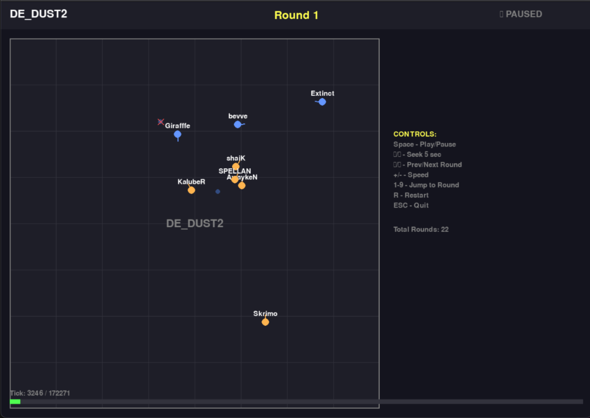
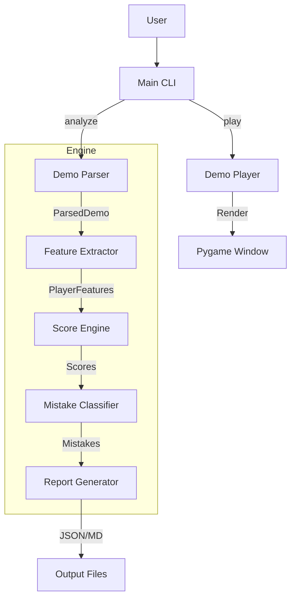

<div align="center">


# FragAudit

### CS2 Performance Verification Engine

[](https://www.python.org/downloads/)
[](LICENSE)
[](CHANGELOG.md)
[](https://github.com/Pl4yer-ONE/FragAudit/actions)

**Forensic demo analysis. Exploit-resistant ratings. Visual playback.**

</div>

---

## Abstract

FragAudit is a deterministic performance auditing engine for Counter-Strike 2 demo analysis. The system implements Win Probability Added (WPA)-based impact scoring, exploit-resistant rating calibration, and visual demo playback without requiring the game client. This tool addresses critical gaps in existing esports analytics by providing transparent, reproducible performance metrics.

---

## I. Introduction

### A. Problem Statement

Existing CS2 analytics suffer from:
- **Inflated Metrics** — Exit frags artificially boost stats
- **Role Blindness** — Support and Entry players evaluated identically
- **Exploit Vulnerability** — Stat padding through exit hunting

### B. Solution

FragAudit provides:
- Deterministic, exploit-resistant rating algorithms
- Behavior-based role classification
- WPA-weighted impact scoring
- Visual demo playback without CS2 installation

---

## II. Demo Player

<div align="center">



*Visual playback showing Round 1 on DE_DUST2. Blue = CT, Orange = T. Player names and positions rendered in real-time.*

</div>

### Usage

```bash
python main.py play match/demo.dem
```

### Controls

| Key | Action |
|-----|--------|
| Space | Play/Pause |
| ← / → | Seek 5 seconds |
| ↑ / ↓ | Previous/Next round |
| + / - | Speed (0.25x–4x) |
| 1-9 | Jump to round |
| ESC | Quit |

### Technical Specifications

- Dynamic tickrate detection (64/128 tick)
- O(log n) tick lookup via binary search
- 500-entry LRU cache for smooth playback
- Delta-time clamping (100ms max) for stability

---

## III. Analysis Engine

### A. Demo Analysis

```bash
python main.py analyze --demo match.dem --markdown -v
```

### B. Sample Output

```
Parsing demo file...
  Parser used: demoparser2
  Kills found: 143
  Damages found: 541
  Players analyzed: 10

==================================================
CS2 COACHING REPORT SUMMARY
==================================================
Players analyzed: 10
Issues found: 6

Issues by type:
  - dry_peek: 6

Player: KalubeR  K/D: 1.64 | HS%: 69.6%
Player: shaiK    K/D: 1.69 | HS%: 72.7%
==================================================
```

### C. Mistake Detection

| Mistake Type | Trigger Condition | Severity |
|--------------|-------------------|----------|
| `dry_peek` | Peeked without flash support | 0.70 |
| `dry_peek_awp` | Dry peeked into AWP | 0.95 |
| `untradeable_death` | Died >400u from teammates | 0.85 |
| `bad_spacing_clump` | Died stacked on 2+ teammates | 0.65 |
| `solo_late_round` | Died alone in late round | 0.75 |

---

## IV. Rating System

### A. Score Bands

| Rating | Classification |
|--------|---------------|
| 95-100 | Elite |
| 85-94 | Carry |
| 70-84 | Strong |
| 50-69 | Average |
| 30-49 | Below Average |
| 15-29 | Liability |

### B. Anti-Exploit Calibration

| Rule | Trigger | Effect |
|------|---------|--------|
| Kill Gate | raw > 105, kills < 18 | 0.90× |
| Exit Tax | exits ≥ 8 | 0.85× |
| Low KDR Cap | KDR < 0.8 | max 75 |
| Trader Ceiling | Trader, KDR < 1.0 | max 80 |
| Rotator Ceiling | Rotator role | max 95 |
| Floor Clamp | Always | min 15 |

---

## V. System Architecture



---

## VI. Installation

### Quick Install

```bash
curl -sSL https://raw.githubusercontent.com/Pl4yer-ONE/FragAudit/main/install.sh | bash
```

### Manual Install

```bash
git clone https://github.com/Pl4yer-ONE/FragAudit.git
cd FragAudit
python -m venv venv
source venv/bin/activate
pip install -r requirements.txt
```

### Verify Installation

```bash
python main.py check-parsers
```

Expected output:
```
CS2 Demo Parser Status
------------------------------
  demoparser2: ✓ Available
```

---

## VII. API Reference

### Demo Player

```python
from src.player import DemoPlayer, Renderer

player = DemoPlayer("match/demo.dem")
renderer = Renderer(player)
renderer.run()
```

### Score Engine

```python
from src.metrics.scoring import ScoreEngine

rating = ScoreEngine.compute_final_rating(
    scores={"raw_impact": 100},
    role="Entry",
    kdr=1.2,
    kills=18,
    exit_frags=3
)
```

---

## VIII. Testing

```bash
python -m pytest tests/ -v
```

```
============================== 26 passed in 0.56s ==============================
```

Test coverage includes:
- Exit frag tax triggers
- Low KDR cap enforcement
- Rotator ceiling validation
- Kill gate activation
- Smurf detection logic

---

## IX. Documentation

| Document | Description |
|----------|-------------|
| [CHANGELOG.md](CHANGELOG.md) | Version history |
| [CONTRIBUTING.md](CONTRIBUTING.md) | Contribution guidelines |
| [COMMERCIAL.md](COMMERCIAL.md) | Commercial licensing terms |
| [ROADMAP.md](ROADMAP.md) | Future development plans |
| [docs/RELEASE_GUIDE.md](docs/RELEASE_GUIDE.md) | Release process |
| [docs/doc_main.md](docs/doc_main.md) | Technical paper (IEEE format) |

---

## X. License

FragAudit is licensed under **PolyForm Noncommercial License 1.0.0**.

Commercial use is **strictly prohibited** without explicit written permission.

📄 [Commercial licensing terms](COMMERCIAL.md) | Open a GitHub issue to request permission.

---

<div align="center">

**FragAudit** — *Where every frag gets audited.*

*v3.0.1+ — Noncommercial Edition*

</div>
